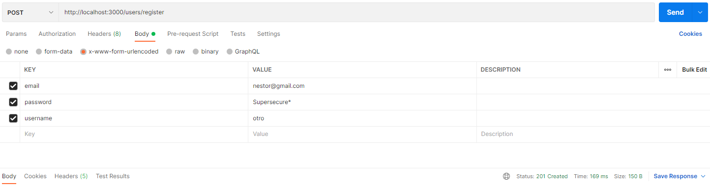
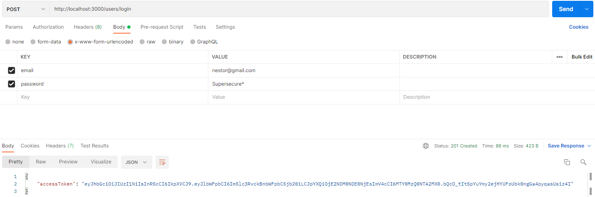
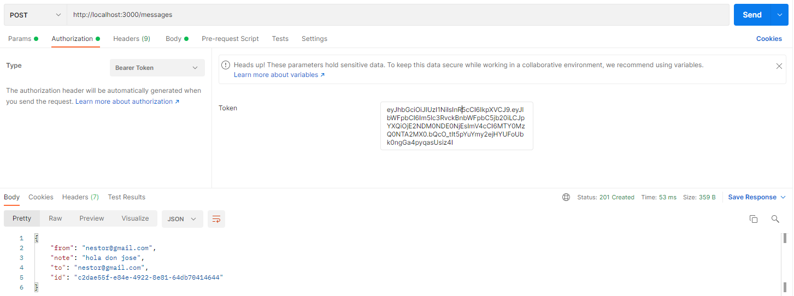

# NestJS Chat API

This API lets you create users, register, login and also allows to create messages. Each message will trigger a notification.


## Endpoints


IMPORTANT: You must register an user and log in to get a JWT token. Once you have the token you have to introduce it as a bearer token in the auth headers in almost all the postman requests.

## Postman Collection

Just for testing purposes on the API you can use this [postman collection](https://www.postman.com/science-technologist-73735036/workspace/kubide-interview/collection/18553977-21f862ee-8867-4c5e-ae2b-91c4a02b6861?ctx=documentation)

## Fast Start - Installation (If you dont want to go step by step)

```bash
make 
```

This command will install dependencies, also it will boot up the docker container with the database and start the server. It is a shortcut of the next steps

## Postman Requests Examples

### Register / Create an user



### Login / Getting the jwt token



### Creating a message



## Installation

```bash
make install
```

Or also

```bash
yarn install
```

## Run the database container

```bash
make db
```

Or also

```bash
docker-compose up -d db
```

## Run the server

```bash
make server
```

Or also

```bash
yarn start:dev
```

## License

Nest is [MIT licensed](LICENSE).
