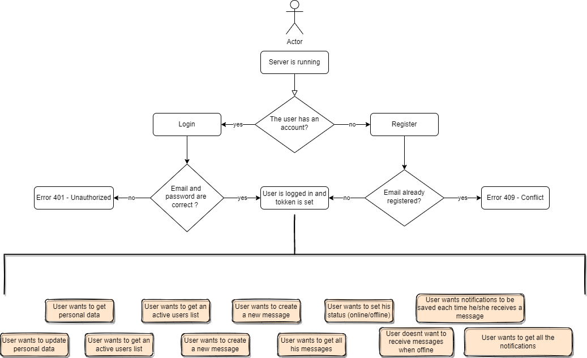
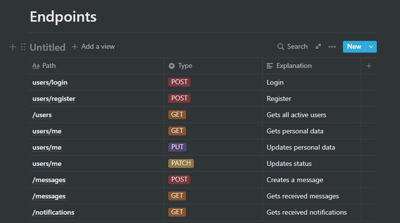

# NestJS Chat API

This API lets you create users, register, login and also allows to create messages. Each message will trigger a notification.



## Endpoints



IMPORTANT: You must register an user and log in to get a JWT token. Once you have the token you have to introduce it as a bearer token in the auth headers in almost all the postman requests.

## Postman Collection

Just for testing purposes on the API you can use this [postman collection](https://www.postman.com/science-technologist-73735036/workspace/kubide-interview/collection/18553977-21f862ee-8867-4c5e-ae2b-91c4a02b6861?ctx=documentation)

## Fast Start (If you dont want to go step by step)

```bash
make 
```

This command will install dependencies, also it will boot up the docker container with the database and start the server. It is a shortcut of the next steps

## Installation

```bash
make install
```

## Run the database container

```bash
make db
```

## Run the server

```bash
make server
```

## License

Nest is [MIT licensed](LICENSE).
